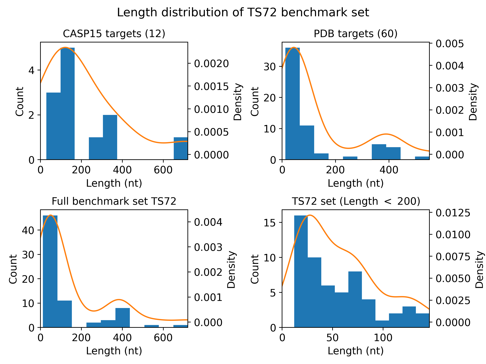

## Are RNA 3D modeling transformers created equal?

by Sumit Tarafder, Rahmatullah Roche, Debswapna Bhattacharya

## RNAmark 
**RNAmark** repository contains the materials related to our large scale study on four transformer based deep learning methods for RNA 3D structure prediction: 
- [DeepFoldRNA](https://github.com/robpearc/DeepFoldRNA/)
- [trRosettaRNA](https://yanglab.nankai.edu.cn/trRosettaRNA/)
- [DRfold](https://zhanggroup.org/DRfold/)
- [RoseTTAFoldNA](https://github.com/uw-ipd/RoseTTAFold2NA/)
  
The predicted 3D structures of all four methods with and without multiple sequence alignment (MSA) are available target-wise under [Predictions](https://github.com/Bhattacharya-Lab/RNAmark/tree/main/Predictions). Experimental structures, corresponding fasta sequences, and MSAs used in the analysis are available under [Data](https://github.com/Bhattacharya-Lab/RNAmark/tree/main/Data).

## Benchmark set
To evaluate the predictive performance of these methods, we used a large benchmark dataset containing 72 RNA targets (TS72).
- 12 targets were taken from [CASP15](https://predictioncenter.org/casp15/index.cgi). 
- 60 non-redundant targets were curated from [PDB](https://www.rcsb.org).

  </a>

## Evaluation metrics
We used the following set of assessment metrics as part of our study.
- Template Modeling Score (**TM-score**) using [US-align](https://zhanggroup.org/US-align/).
- Local Distance Difference Test (**lDDT**) calculated via the docker image obtained from [OpenStructure registry](https://git.scicore.unibas.ch/schwede/openstructure/-/tree/master/docker).
- Interaction Network Fidelity (**INF**) score evaluated using the casp-rna pipeline available [here](https://github.com/DasLab/casp-rna).
- **Clash score** from MolProbity package available [here](https://github.com/rlabduke/MolProbity).

## Prediction scores per method
- [DeepFoldRNA](#deepfoldrna)
- [trRosettaRNA](#trrosettarna)
- [DRfold](#drfold)
- [RoseTTAFoldNA](#rosettafoldna)

## DeepFoldRNA

|Targets|TM-score|lDDT|INF|Clash-score|
|:---:|:---:|:---:|:---:|:---:|
|6YMC_A|0.48|0.67|0.34|158.65|
|7ECM_A|0.27|0.69|0.55|145.08|
|7EDL_A|0.36|0.68|0.34|192.36|
|7EDM_A|0.34|0.66|0.43|221.91|
|7EEM_A|0.45|0.61|0.42|144.23|
|7EFG_A|0.31|0.55|0.39|147.97|
|7EQJ_A|0.73|0.64|0.26|175.77|
|7EXY_A|0.24|0.48|0|138.61|
|7KUB_A|0.35|0.5|0.22|180.81|
|7KUC_A|0.49|0.62|0.31|159.92|
|7KUD_A|0.25|0.43|0|182.27|
|7KVT_B|0.37|0.4|0.26|181.44|
|7MLW_F|0.81|0.62|0.3|185.82|
|7Q48_A|0.13|0.21|0.25|148.25|
|7Q6L_A|0.14|0.2|0.1|133.9|
|7Q7X_B|0.26|0.69|0.54|172.28|
|7Q7X_C|0.24|0.42|0.32|123.06|
|7QA2_A|0.11|0.21|0.23|250|
|7QDU_Q|0.19|0.38|0.22|152.34|
|7QP2_A|0.46|0.66|0.42|144.93|
|7R6L_A|0.57|0.47|0.28|164.27|
|7R6L_B|0.17|0.43|0.17|164.61|
|7R6M_A|0.59|0.48|0.3|165.4|
|7RQ5_A|0.51|0.68|0.47|240.26|
|7RWR_A|0.38|0.47|0.29|139.44|
|7SHX_A|0.22|0.47|0.26|169.01|
|7UCR_A|0.51|0.64|0.41|140.53|
|7UGA_A|0.41|0.57|0.36|130.81|
|7UMC_A|0.32|0.56|0.27|132.82|
|7UMD_A|0.26|0.55|0.16|158.06|
|7UME_A|0.3|0.59|0.42|204.26|
|7UQ6_B|0.63|0.59|0.32|161.23|
|7UVT_A|0.58|0.49|0.31|197.29|
|7UZ0_A|0.77|0.63|0.24|155.95|
|7V06_A|0.45|0.6|0.2|158.87|
|7V9E_A|0.31|0.46|0.15|186.5|
|7VFT_A|0.21|0.66|0.45|114.56|
|7WIA_V|0.4|0.58|0.24|144.42|
|7XD3_N|0.57|0.47|0.25|180.91|
|7XJZ_B|0.75|0.61|0.09|189.89|
|7XK0_B|0.8|0.61|0.13|183.01|
|7XSN_N|0.58|0.49|0.33|184.93|
|7YC8_N|0.54|0.46|0.31|176.91|
|7YGC_N|0.54|0.48|0.3|184.46|
|8BGU_3|0.67|0.61|0.2|176.79|
|8D2A_A|0.3|0.55|0.33|193.4|
|8DMB_W|0.16|0.37|0.22|158.69|
|8DP3_R|0.3|0.52|0.33|185.15|
|8E0F_D|0.35|0.72|0.47|118.91|
|8EG0_C|0.65|0.61|0.3|146.87|
|8F4O_B|0.58|0.57|0.24|145.62|
|8FCS_A|0.66|0.66|0.31|163.48|
|8GXC_A|0.32|0.38|0.15|146.23|
|8HB8_A|0.22|0.41|0.25|175.3|
|8HBA_A|0.28|0.38|0.29|181.64|
|8HBA_B|0.19|0.38|0.29|183.98|
|8HD6_N|0.57|0.5|0.24|187.21|
|8I3Z_B|0.12|0.39|0.22|200.4|
|8I43_A|0.21|0.55|0.26|198.02|
|8I7N_N|0.57|0.47|0.24|186.68|
|R1107|0.48|0.53|0.23|162.62|
|R1108|0.48|0.56|0.35|152.25|
|R1116|0.38|0.53|0.24|184.94|
|R1117|0.21|0.43|0.18|196.54|
|R1126|0.18|0.37|0.21|154.74|
|R1128|0.36|0.61|0.32|162.87|
|R1136|0.14|0.28|0.27|131.86|
|R1138|0.12|0.36|0.28|140.9|
|R1149|0.28|0.53|0.12|164.71|
|R1156|0.29|0.53|0.28|165.26|
|R1189|0.23|0.46|0.27|148.38|
|R1190|0.25|0.5|0.25|148.38|
| | | | | |
|Mean|0.39|0.52|0.28|167.08|

## trRosettaRNA

|Targets|TM-score|lDDT|INF|Clash-score|
|:---:|:---:|:---:|:---:|:---:|
|6YMC_A|0.4|0.8|0.89|5.98|
|7ECM_A|0.24|0.7|0.76|2.57|
|7EDL_A|0.34|0.75|0.88|9.87|
|7EDM_A|0.29|0.75|0.88|2.82|
|7EEM_A|0.54|0.8|0.85|16.67|
|7EFG_A|0.44|0.77|0.96|17.57|
|7EQJ_A|0.67|0.75|0.79|28.23|
|7EXY_A|0.17|0.27|0.57|0|
|7KUB_A|0.35|0.55|0.76|14.53|
|7KUC_A|0.48|0.77|0.93|1.91|
|7KUD_A|0.38|0.44|0.74|0|
|7KVT_B|0.23|0.38|0.56|69.78|
|7MLW_F|0.53|0.6|0.67|35.17|
|7Q48_A|0.12|0.22|0.43|1.39|
|7Q6L_A|0.11|0.27|0.32|9.72|
|7Q7X_B|0.31|0.74|0.93|2.6|
|7Q7X_C|0.26|0.45|0.75|0|
|7QA2_A|0.11|0.23|0.38|0|
|7QDU_Q|0.17|0.37|0.64|42.67|
|7QP2_A|0.64|0.85|0.94|15.48|
|7R6L_A|0.39|0.44|0.62|43.53|
|7R6L_B|0.21|0.47|0.61|0|
|7R6M_A|0.33|0.43|0.65|31.77|
|7RQ5_A|0.35|0.67|0.81|8.1|
|7RWR_A|0.38|0.58|0.82|13.92|
|7SHX_A|0.2|0.52|0.6|27.28|
|7UCR_A|0.62|0.82|0.84|36.61|
|7UGA_A|0.36|0.7|0.84|22.43|
|7UMC_A|0.34|0.59|0.68|40.37|
|7UMD_A|0.21|0.56|0.73|28.64|
|7UME_A|0.43|0.68|0.85|14.38|
|7UQ6_B|0.65|0.72|0.7|40.56|
|7UVT_A|0.25|0.47|0.67|25.63|
|7UZ0_A|0.74|0.76|0.75|58.76|
|7V06_A|0.38|0.63|0.83|17.52|
|7V9E_A|0.27|0.5|0.63|48.26|
|7VFT_A|0.2|0.74|0.93|0|
|7WIA_V|0.36|0.71|0.8|20.89|
|7XD3_N|0.21|0.41|0.55|43.09|
|7XJZ_B|0.7|0.75|0.78|39.05|
|7XK0_B|0.78|0.75|0.64|41.91|
|7XSN_N|0.25|0.44|0.64|40.59|
|7YC8_N|0.28|0.44|0.65|31.75|
|7YGC_N|0.34|0.45|0.62|33.73|
|8BGU_3|0.63|0.71|0.73|51.52|
|8D2A_A|0.33|0.76|0.83|25.3|
|8DMB_W|0.16|0.43|0.63|17.56|
|8DP3_R|0.28|0.57|0.71|60.85|
|8E0F_D|0.28|0.84|0.67|23.37|
|8EG0_C|0.58|0.71|0.79|19.61|
|8F4O_B|0.54|0.64|0.64|81.24|
|8FCS_A|0.52|0.77|0.83|17.54|
|8GXC_A|0.27|0.35|0.53|19.18|
|8HB8_A|0.23|0.37|0.51|34.21|
|8HBA_A|0.22|0.37|0.53|38.49|
|8HBA_B|0.24|0.37|0.48|36.4|
|8HD6_N|0.23|0.43|0.61|31.91|
|8I3Z_B|0.13|0.35|0.57|5.96|
|8I43_A|0.19|0.65|0.67|18.12|
|8I7N_N|0.21|0.41|0.58|45.56|
|R1107|0.26|0.51|0.69|46.15|
|R1108|0.43|0.67|0.67|68.29|
|R1116|0.56|0.62|0.66|31.8|
|R1117|0.35|0.51|0.52|15.12|
|R1126|0.22|0.49|0.7|62.36|
|R1128|0.31|0.66|0.75|82.37|
|R1136|0.24|0.5|0.77|5.24|
|R1138|0.12|0.34|0.59|21.32|
|R1149|0.26|0.48|0.6|43.14|
|R1156|0.25|0.55|0.7|19.4|
|R1189|0.21|0.49|0.56|34.22|
|R1190|0.22|0.52|0.62|29.78|
| | | | | |
|Mean|0.34|0.57|0.69|27.39|

## DRfold

|Targets|TM-score|lDDT|INF|Clash-score|
|:---:|:---:|:---:|:---:|:---:|
|6YMC_A|0.56|0.86|0.93|19.12|
|7ECM_A|0.24|0.7|0.82|120.51|
|7EDL_A|0.39|0.87|0.97|11.25|
|7EDM_A|0.31|0.84|0.86|4.23|
|7EEM_A|0.52|0.83|0.83|93.94|
|7EFG_A|0.33|0.74|0.8|123.99|
|7EQJ_A|0.67|0.79|0.83|103.65|
|7EXY_A|0.25|0.58|0.81|63.24|
|7KUB_A|0.42|0.73|0.87|74.88|
|7KUC_A|0.51|0.78|0.9|47.71|
|7KUD_A|0.43|0.73|0.9|66.67|
|7KVT_B|0.38|0.5|0.59|251.26|
|7MLW_F|0.47|0.56|0.68|167.91|
|7Q48_A|0.13|0.23|0.41|115.76|
|7Q6L_A|0.14|0.24|0.36|41.61|
|7Q7X_B|0.23|0.77|0.87|48.3|
|7Q7X_C|0.2|0.5|0.7|65.81|
|7QA2_A|0.18|0.24|0.36|78.62|
|7QDU_Q|0.1|0.27|0.1|119.09|
|7QP2_A|0.61|0.9|0.88|83.14|
|7R6L_A|0.25|0.31|0.25|360.32|
|7R6L_B|0.15|0.56|0.6|181.19|
|7R6M_A|0.24|0.29|0.25|365.68|
|7RQ5_A|0.29|0.47|0.76|53.48|
|7RWR_A|0.43|0.57|0.77|213.58|
|7SHX_A|0.26|0.55|0.7|197.34|
|7UCR_A|0.63|0.87|0.84|96|
|7UGA_A|0.36|0.73|0.8|128.75|
|7UMC_A|0.48|0.68|0.86|89.98|
|7UMD_A|0.28|0.62|0.78|128.12|
|7UME_A|0.39|0.72|0.81|74.61|
|7UQ6_B|0.62|0.76|0.75|152.54|
|7UVT_A|0.32|0.34|0.32|389.35|
|7UZ0_A|0.56|0.66|0.7|122.15|
|7V06_A|0.44|0.75|0.81|81.62|
|7V9E_A|0.28|0.61|0.81|178.07|
|7VFT_A|0.22|0.7|0.68|79.73|
|7WIA_V|0.42|0.71|0.84|72.15|
|7XD3_N|0.26|0.3|0.29|347.05|
|7XJZ_B|0.74|0.76|0.77|67.07|
|7XK0_B|0.79|0.76|0.75|63.56|
|7XSN_N|0.31|0.34|0.39|400.67|
|7YC8_N|0.33|0.29|0.4|466.11|
|7YGC_N|0.3|0.35|0.39|433.38|
|8BGU_3|0.67|0.8|0.86|90.3|
|8D2A_A|0.29|0.69|0.84|102.25|
|8DMB_W|0.19|0.37|0.32|415.37|
|8DP3_R|0.31|0.68|0.81|172.06|
|8E0F_D|0.33|0.9|0.89|17.51|
|8EG0_C|0.63|0.75|0.86|91.61|
|8F4O_B|0.59|0.71|0.84|87.35|
|8FCS_A|0.71|0.81|0.88|76.82|
|8GXC_A|0.22|0.34|0.43|306.88|
|8HB8_A|0.24|0.38|0.42|292.22|
|8HBA_A|0.18|0.35|0.47|285.43|
|8HBA_B|0.2|0.36|0.5|280.43|
|8HD6_N|0.25|0.3|0.27|363.67|
|8I3Z_B|0.14|0.39|0.61|94.43|
|8I43_A|0.22|0.73|0.78|49.34|
|8I7N_N|0.27|0.31|0.26|323.8|
|R1107|0.24|0.41|0.61|135.59|
|R1108|0.37|0.65|0.79|165.08|
|R1116|0.46|0.61|0.79|209.02|
|R1117|0.25|0.58|0.65|195.02|
|R1126|0.14|0.41|0.36|525.35|
|R1128|0.28|0.7|0.8|249.9|
|R1136|0.17|0.37|0.32|414.27|
|R1138|0.09|0.27|0.02|66.67|
|R1149|0.31|0.65|0.79|164.21|
|R1156|0.29|0.48|0.56|286.65|
|R1189|0.22|0.47|0.57|355.28|
|R1190|0.24|0.52|0.56|355.28|
| | | | | |
|Mean|0.35|0.57|0.65|175.21|

## RoseTTAFoldNA

|Targets|TM-score|lDDT|INF|Clash-score|
|:---:|:---:|:---:|:---:|:---:|
|6YMC_A|0.59|0.94|0.96|9.56|
|7ECM_A|0.38|0.85|0.95|0|
|7EDL_A|0.39|0.88|0.97|7.03|
|7EDM_A|0.34|0.83|0.91|9.86|
|7EEM_A|0.49|0.9|0.94|8.32|
|7EFG_A|0.2|0.71|0.65|191.39|
|7EQJ_A|0.76|0.82|0.9|22.06|
|7EXY_A|0.22|0.54|0.84|31.5|
|7KUB_A|0.42|0.59|0.79|27.45|
|7KUC_A|0.44|0.81|0.88|113.03|
|7KUD_A|0.28|0.7|0.86|94.79|
|7KVT_B|0.26|0.43|0.58|64.77|
|7MLW_F|0.81|0.76|0.81|50.98|
|7Q48_A|0.13|0.28|0.36|69.93|
|7Q6L_A|0.16|0.24|0.35|24.9|
|7Q7X_B|0.19|0.75|0.93|15.56|
|7Q7X_C|0.19|0.45|0.75|6.43|
|7QA2_A|0.11|0.28|0.32|93.92|
|7QDU_Q|0.14|0.27|0.57|49.55|
|7QP2_A|0.55|0.93|0.94|9.5|
|7R6L_A|0.56|0.58|0.78|44.93|
|7R6L_B|0.12|0.44|0.58|35.42|
|7R6M_A|0.55|0.53|0.75|58.37|
|7RQ5_A|0.32|0.67|0.77|66.13|
|7RWR_A|0.37|0.53|0.79|58.24|
|7SHX_A|0.24|0.58|0.76|66.34|
|7UCR_A|0.62|0.93|0.96|8|
|7UGA_A|0.36|0.67|0.78|70.71|
|7UMC_A|0.53|0.7|0.86|59.14|
|7UMD_A|0.25|0.58|0.83|32.56|
|7UME_A|0.32|0.72|0.85|111.36|
|7UQ6_B|0.69|0.83|0.83|44.26|
|7UVT_A|0.47|0.56|0.75|44.98|
|7UZ0_A|0.73|0.81|0.84|30.26|
|7V06_A|0.31|0.67|0.85|48.83|
|7V9E_A|0.3|0.53|0.75|71.76|
|7VFT_A|0.17|0.78|0.68|25.37|
|7WIA_V|0.36|0.68|0.79|52.5|
|7XD3_N|0.48|0.52|0.7|50.29|
|7XJZ_B|0.73|0.81|0.86|25.15|
|7XK0_B|0.78|0.82|0.86|28.07|
|7XSN_N|0.5|0.53|0.77|48.46|
|7YC8_N|0.54|0.55|0.77|47.49|
|7YGC_N|0.57|0.56|0.75|46.19|
|8BGU_3|0.64|0.76|0.88|36.79|
|8D2A_A|0.4|0.84|0.92|46.9|
|8DMB_W|0.2|0.42|0.7|47.94|
|8DP3_R|0.34|0.62|0.82|41.84|
|8E0F_D|0.24|0.77|0.87|9.72|
|8EG0_C|0.61|0.75|0.91|31.46|
|8F4O_B|0.59|0.74|0.89|29.86|
|8FCS_A|0.6|0.81|0.89|31.11|
|8GXC_A|0.37|0.4|0.6|29.53|
|8HB8_A|0.21|0.32|0.52|66|
|8HBA_A|0.24|0.3|0.55|34.57|
|8HBA_B|0.24|0.31|0.59|43.69|
|8HD6_N|0.51|0.54|0.72|68.33|
|8I3Z_B|0.15|0.35|0.42|49.7|
|8I43_A|0.24|0.73|0.85|54.55|
|8I7N_N|0.48|0.54|0.71|61.28|
|R1107|0.34|0.65|0.84|35.65|
|R1108|0.33|0.68|0.86|40.2|
|R1116|0.44|0.61|0.8|48.34|
|R1117|0.19|0.32|0.6|59.2|
|R1126|0.23|0.48|0.71|34.25|
|R1128|0.28|0.65|0.8|42.87|
|R1136|0.19|0.5|0.76|47.45|
|R1138|0.15|0.26|0.59|51.67|
|R1149|0.26|0.53|0.72|62.31|
|R1156|0.3|0.63|0.8|41.77|
|R1189|0.22|0.54|0.73|43.51|
|R1190|0.25|0.57|0.72|37.55|
| | | | | |
|Mean|0.38|0.61|0.76|45.88|
